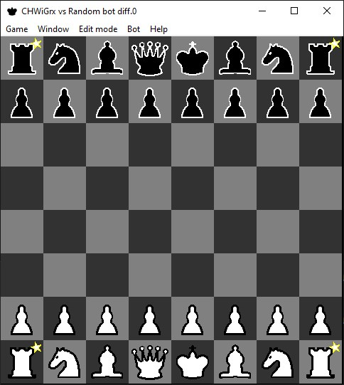
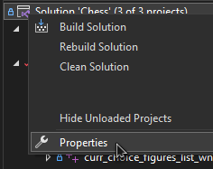
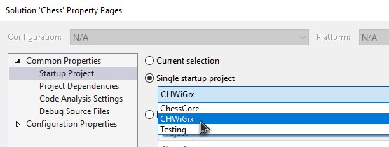
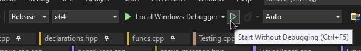

# <ins>Ch</ins>ess <ins>Wi</ins>th <ins>Gr</ins>aphi<ins>cs</ins>

A chessboard simulator written in __C++__ using __winapi__.

# Setup

1. Open [Chess.sln](./Chess.sln) with Visual Studio 2022.

1. Go to solution properties.

1. Choose CHWiGrx project as single startup project.

1. Project ready for build and launch

