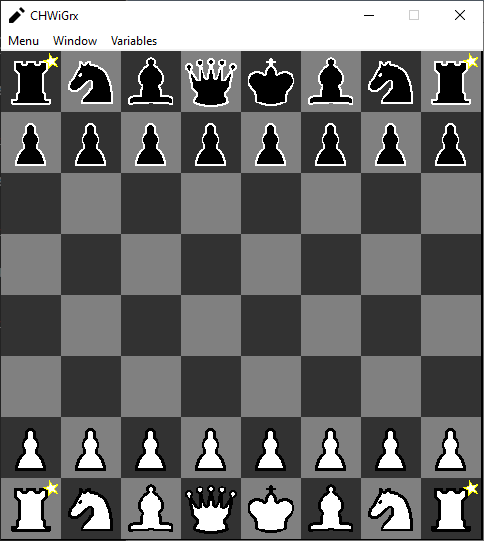
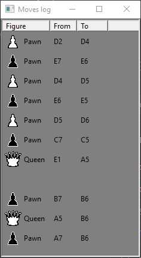
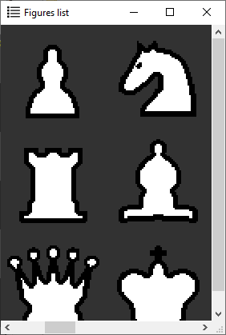
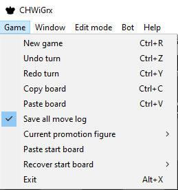
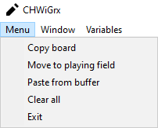

# <ins>Ch</ins>ess <ins>Wi</ins>th <ins>Gr</ins>aphi<ins>cs</ins>

A chessboard simulator written in __C++23__ using __winapi__.

|game mode|edit mode|
|:-------:|:-------:|
|||

|moves log (game mode)|figures list (edit mode)|
|:-------------------:|:----------------------:|
|||

|game menu|edit menu|
|:-------:|:-------:|
|||

# Setup

1. Open [Chess.sln](./Chess.sln) with Visual Studio 2022.

2. Go to solution properties.

3. Choose CHWiGrx project as single startup project.

4. Project ready for build and launch.

